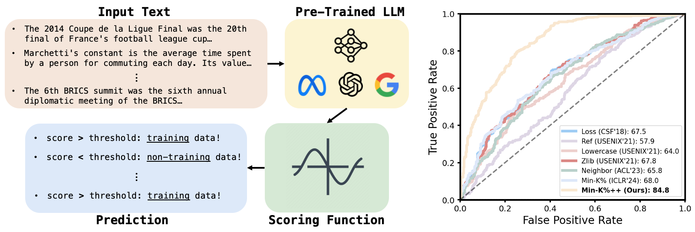

# Min-K%++: Improved Baseline for Detecting Pre-Training Data of LLMs

## Overview



We propose a new Membership Inference Attack method named **Min-K%++** for detecting pre-training data of LLMs, which achieves SOTA results among reference-free methods. This repo contains the lightweight implementation of our method (along with all the baselines) on the [WikiMIA benchmark](https://huggingface.co/datasets/swj0419/WikiMIA). For experiments on the [MIMIR benchmark](https://github.com/iamgroot42/mimir), please refer to our fork [here](https://github.com/zjysteven/mimir).

[](https://arxiv.org/abs/2404.02936)
[](https://openreview.net/forum?id=ZGkfoufDaU)


## Setup
### Environment
First install torch according to your environment. Then simply install dependencies by `pip install -r requirements.txt`.

Our code is tested with Python 3.8, PyTorch 2.2.0, Cuda 12.1.

### Data
All data splits are hosted on huggingface and will be automatically loaded when running scripts.
- The original WikiMIA is from [🤗swj0419/WikiMIA](https://huggingface.co/datasets/swj0419/WikiMIA). 
- The WikiMIA authors also studied a *paraphrased* setting, yet the paraphrased data was not released. Here we provide our version, which is paraphrased by ChatGPT with the instruction of replacing certain number of words. The data is hosted at [🤗zjysteven/WikiMIA_paraphrased_perturbed](https://huggingface.co/datasets/zjysteven/WikiMIA_paraphrased_perturbed).
- In addition, to run Neighbor attack, one needs to perturb each input sentence (with masked language model) to create perturbed neighbors. We also provide the perturbed data for everyone to use at [🤗zjysteven/WikiMIA_paraphrased_perturbed](https://huggingface.co/datasets/zjysteven/WikiMIA_paraphrased_perturbed).
- Lastly, we propose a new setting that simulates "detect-while-generating" by concatenating the training text with the leading non-training text. This split is hosted at [🤗zjysteven/WikiMIA_concat](https://huggingface.co/datasets/zjysteven/WikiMIA_concat).

## Running
There are four scripts, each of which is self-contained to best facilitate quick reproduction and extension. The meaning of the arguments of each script should be clear from their naming.

- `run.py` will run the Loss, Zlib, Min-K%, and Min-K%++ attack on the WikiMIA dataset (either the original or the paraphrased version) with the specified model.
- `run_ref.py` will run the Ref, Lowercase attack on the WikiMIA dataset (either the original or the paraphrased version) with the specified model.
- `run_neighbor.py` will run the Neighbor attack on the WikiMIA dataset (either the original or the paraphrased version) with the specified model.
- `run_concat.py` focus on the WikiMIA_concat dataset with the specified model. For this setting only the Loss, Zlib, Min-K%, and Min-K%++ are applicable.

The outputs of these scripts will be a csv file consisting of method results (AUROC and TPR@FPR=5%) stored in the `results` directory, with the filepath indicating the dataset and model. Sample results by running the four scripts are provided in the `results` directory.

## HF paths of evaluated model in the paper
- Mamba: [state-spaces/mamba-1.4b-hf](https://huggingface.co/state-spaces/mamba-1.4b-hf)
, [state-spaces/mamba-2.8b-hf](https://huggingface.co/state-spaces/mamba-2.8b-hf)
- Pythia: [EleutherAI/pythia-2.8b](https://huggingface.co/EleutherAI/pythia-2.8b), [EleutherAI/pythia-6.9b](https://huggingface.co/EleutherAI/pythia-6.9b), [EleutherAI/pythia-12b](https://huggingface.co/EleutherAI/pythia-12b)
- GPT-NeoX: [EleutherAI/gpt-neox-20b](https://huggingface.co/EleutherAI/gpt-neox-20b)
- LLaMA: [huggyllama/llama-13b](https://huggingface.co/huggyllama/llama-13b), [huggyllama/llama-30b](https://huggingface.co/huggyllama/llama-30b), [huggyllama/llama-65b](https://huggingface.co/huggyllama/llama-65b)
- OPT: [facebook/opt-66b](https://huggingface.co/facebook/opt-66b)


## Acknowledgement
This codebase is adapted from the [official repo](https://github.com/swj0419/detect-pretrain-code) of Min-K% and WikiMIA.

## Citation
If you find this work/repo/data splits useful, please consider citing our paper:
```
@inproceedings{
  zhang2025mink,
  title={Min-K\%++: Improved Baseline for Pre-Training Data Detection from Large Language Models},
  author={Jingyang Zhang and Jingwei Sun and Eric Yeats and Yang Ouyang and Martin Kuo and Jianyi Zhang and Hao Frank Yang and Hai Li},
  booktitle={The Thirteenth International Conference on Learning Representations},
  year={2025},
  url={https://openreview.net/forum?id=ZGkfoufDaU}
}
```
